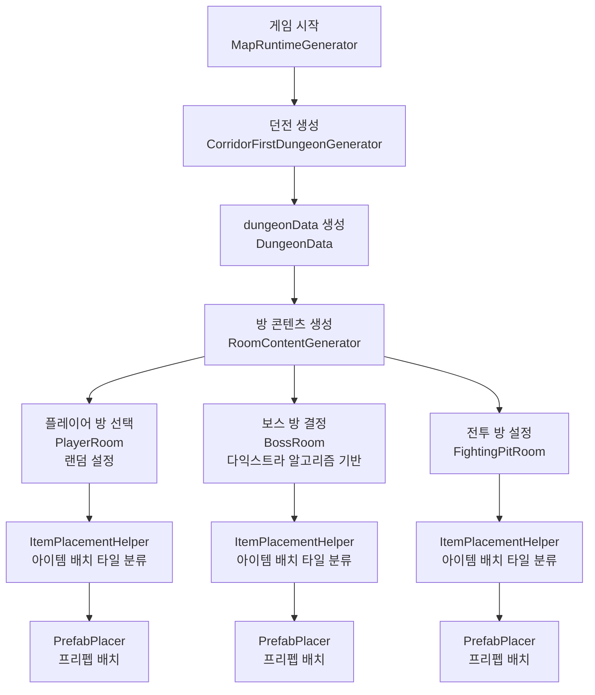

# PlaugeBorn
> ### PlagueBorn의 절차적 맵 생성 시스템은 복도와 방으로 구성된 던전을 동적으로 생성하고, 방 종류(플레이어 방, 보스 방, 전투 방)를 설정한 후, 스크립터블 오브젝트를 활용해 아이템과 적을 배치하여 도전적인 로그라이크 던전을 완성합니다.

아래는 구현을 맡은 **`절차적 맵 생성`** 시스템의 구조와 동작 방식을 설명합니다. 

  

## <파일 구조>
모듈은 크게 다음과 같은 세 영역으로 나뉩니다:
- 던전 생성 **`(Dungeon)`**: 던전 생성 알고리즘, 지도 시각화, 벽 배치 등
- 경로 계산 **`(DecisionSystem)`**: 방 간 거리 계산을 위한 그래프 기반 경로 탐색
- 방 컨텐츠 배치 **`(RoomSystem)`**: 방 종류 설정, 아이템 및 적 배치
---

    📂Dungeon
     ├─ 📄 AbstractDungeonGenerator.cs - 던전 생성의 추상 인터페이스를 정의하여 알고리즘 표준화
     ├─ 📄 ProceduralGenerationAlgo.cs - Random Walk, Binary Space Partitioning, 방향 벡터 계산 등 던전 생성에 필요한 알고리즘을 제공
     ├─ 📄 MapRuntimeGenerator.cs - 게임 시작 시, 던전을 생성하도록 이벤트를 발생 시키는 클래스.
     ├─ 📄 SimpleRandomWalkDungeonGenerator.cs - 단순 랜덤 워크 단일 던전 생성
     ├─ 📄 CorridorFirstDungeonGenerator.cs - 복도를 먼저 생성하고 방을 생성해서, 방들이 복도와 연결되어 있는 구조(프로젝트에 사용할 구조)
     ├─ 📄 RoomFirstDungeonGenerator.cs - BSP를 통해 공간을 분할 후, 각각의 분할된 공간에 방을 생성하고 복도로 연결하는 구조
     ├─ 📄 TilemapVisualizer.cs - 좌표에 타일을 배치하여, 던전을 시각화
     ├─ 📄 WallTypesHelper.cs - 방향별 벽 배치를 위한 비트 기반 데이터 정의
     ├─ 📄 WallGenerator.cs - 적절한 위치에 방향에 맞는 벽 생성
    
      📂 Dungeon/DecisionSystem
       ├─ 📄 DijkstraAlgorithm.cs - 시작 방에 대해 다익스트라 알고리즘을 수행해서, 다른 방들로 가는 비용을 계산
       ├─ 📄 Graph.cs - 2D 벡터 리스트를 그래프로 초기화하여 인접 정점 탐색
       ├─ 📄 GraphTest.cs - 플레이어 방의 좌표를 시작으로, 다른 방의 바닥 좌표들 간에 다익스트라 알고리즘을 통해 비용을 계산
    
      📂 Dungeon/RoomSystem
       ├─ 📄 RoomGenerator.cs - 방을 생성하는 기본 함수 ProcessRoom 오버라이딩을 위한 추상 클래스. 해당 방에, 방 프리펩에 저장되어 있는 정보를 토대로 오브젝트를 배치하고 배치한 오브젝트 목록을 리스트로 반환.
       ├─ 📄 DungeonData.cs - 던전의 데이터를 관리하는 클래스.(던전 내 방 목록, 복도 좌표, 바닥 좌표, 복도 제외한 방 좌표를 얻는 함수 등)
       ├─ 📄 RoomContentGenerator.cs - 방의 컨텐츠를 생성하는 클래스.
       ├─ 📄 PrefabPlacer.cs - 프리펩을 배치가능한 좌표에 인스턴스화 하는 클래스.
       ├─ 📄 PlayerRoom.cs - 처음 시작 하는 방. 즉, 플레이어가 처음에 위치할 방에 플레이어와 아이템을 배치하는 클래스.
       ├─ 📄 BoosRoom.cs - 보스 방에 보스 등 오브젝트를 배치하는 클래스.
       ├─ 📄 FightingPitRoom.cs - 전투가 주 컨텐츠가 되는 방에 아이템과 적을 배치하는 클래스.
    
        📂 Dungeon/RoomSystem/Item
         ├─ 📄 ItemData.cs - 아이템별 데이터를 저장하고 있는 스크립터블 오브젝트
         ├─ 📄 Item.cs - 아이템 정보 관리 클래스.
         ├─ 📄 ItemPlacementHelper.cs - 아이템 배치 가능 좌표를 계산 및 반환하는 클래스.

  

## <던전 생성 과정>
#### 1. 게임 시작 (MapRuntimeGenerator → OnStart 이벤트 발생)
  - OnStart에 CorridorFirstDungeonGenerator.GenerateDungeon()이 연결됨
  - CorridorFirstDungeonGenerator가 던전 생성 시작

#### 2. 던전 생성 완료 (CorridorFirstDungeonGenerator → OnDungeonFloorReady 이벤트 발생)
  - 완성된 던전에 대한 정보를 가진 던전 데이터(dungeonData) 생성 후 이벤트로 전달
  - dungeonData에는 방들의 정보, 던전 전체의 바닥 좌표, 복도 좌표가 있음.

#### 3. 방 세부 설정 (RoomContentGenerator.GenerateRoomContent(dungeonData))
  - 방의 종류 결정(플레이어 방, 전투 방, 보스 방 등)
  - 방 종류에 따른 아이템, 적, 플레이어 배치
---

  

## <방 내 오브젝트 배치 과정>
#### 1. 던전 생성이 완료되면, RoomContentGenerator의 GenerateRoomContent(dungeonData) 함수 호출
#### 2. 방들 중에서 랜덤으로 플레이어 방을 선택하고, 플레이어 방을 시작으로 다익스트라 알고리즘 수행.
#### 3. 플레이어 방 프리펩에 저장되어 있는 정보(배치될 오브젝트)를 토대로 오브젝트를 배치.
#### 4. 다익스트라 결과를 통해, 플레이어 방에서 이동하는 데 있어 가장 비용이 큰 방을 보스 방으로 선택.
#### 5. 보스 방 프리펩에 저장되어 있는 정보를 토대로 오브젝트 배치.
#### 6. 나머지 방들은 전투 방으로 간주하고, 전투 방 프리펩에 있는 정보를 토대로 오브젝트를 배치.
---

  

## <오브젝트 배치 세부 흐름>
### 1. 방에 대해, ItemPlacementHelper 객체 생성.
  - 방의 바닥 타일 좌표를 받아서, 좌표들을 OpenSpace 혹은 NearWall 타입으로 분류.

### 2. 방 프리펩에 저장되어 있는 아이템 정보를 넘겨주어, PrefabPlacer의 PlaceAllItems 함수 호출.
  - 전달받은 아이템을 배치할 수 있는 타일 좌표를 ItemPlacementHelper가 계산. 아이템 배치 위치가 NearWall인지 OpenSpace인지에 따라서 별도 계산.
  - 배치할 수 있는 타일 좌표가 계산되면, 해당 좌표에 아이템 prefab을 인스턴스화.
  - 이 때, 프리펩은 itemData 스크립터블 오브젝트에 저장되어 있는 Sprite와 Size로 초기화 됨.
  - 즉, 아이템 별 프리펩으로 정보를 관리하는게 아니라, 스크립터블 오브젝트로 관리하고 이 정보를 하나의 프리펩에 덮어 씌우면서 생성하는 것.
---

  

## <전체 흐름 플로우차트>

